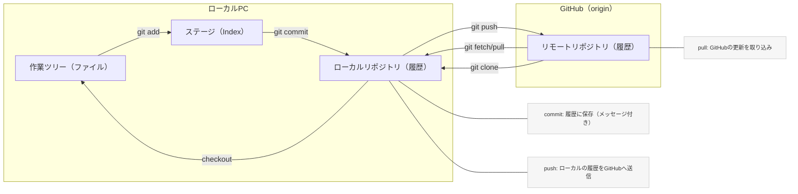
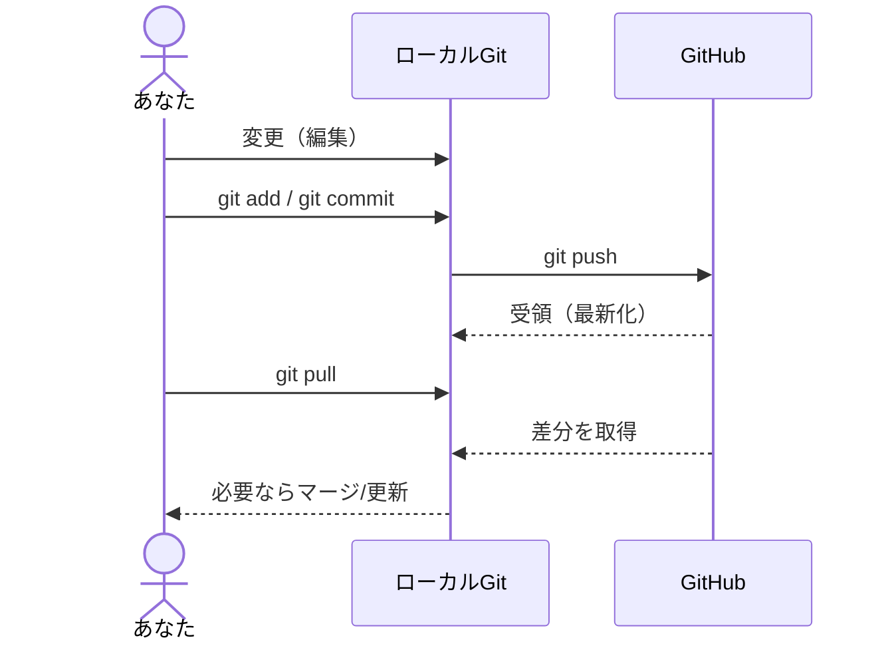
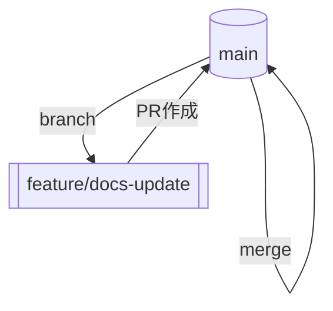

# 非エンジニア向け GitHub 超入門

## GitHubとは？
- ファイルの保管庫＋タイムマシン＋共同作業の場所。
- 変更の履歴が自動で残り、いつでも過去に戻せる“共有ノート”。
- Webブラウザやアプリ（GitHub Desktop）で使えるクラウドサービス。

## 何のためにある？
- なくならない・壊れない（履歴が残る、復元できる）。
- 誰が何を変えたか見える（差分・コメント・承認）。
- チーム作業を効率化（レビュー、課題管理、自動化）。

## どんなことができる？
- 共同編集（差分が色付きで見える、コメントで指摘）。
- 課題管理（Issue）でタスクを一元化。
- 自動処理（Actions）でPDF化やチェック、サイト更新を自動化。
- ブラウザ開発（Codespaces）でどこでも同じ環境。
- 公開サイト（Pages）で文書やサイトを公開。

## なぜ便利？（非エンジニア視点）
- 履歴が残る: 上書きミスも巻き戻せる。
- 差分が見える: どこが変わったか一目でわかる。
- 共有が楽: メール添付の往復が不要、最新版が常に1か所。
- 承認フロー: 下書き→レビュー→承認（プルリク）で品質担保。
- 自動化: コミットしたらPDF出力・体裁チェックなどを自動で実行。

## 「読むだけ」→「書く人」への最初の一歩
1) ツールを用意
- かんたん: GitHub Desktop（ボタン操作中心）
- PCに入れたくない: GitHub Codespaces（ブラウザだけでOK）

2) リポジトリを用意
- GitHubページで「Code」→「Open with GitHub Desktop」
- もしくは「Create codespace on main」でブラウザ開発環境を起動

3) 直して保存
- 文章・画像・資料を編集→“Commit”（メモ＝変更理由）→“Push”（アップロード）

4) レビューを依頼
- “Pull Request（PR）”を作成→相手が差分を確認・コメント→承認で反映

## 用語ミニ辞典
- リポジトリ（Repo）: プロジェクトのフォルダ。中にファイルと履歴が入る。
- コミット（Commit）: スナップショット（保存）＋メッセージで“なぜ”を記録。
- プッシュ（Push）: 手元の変更をGitHubへアップロード。
- プルリク（Pull Request）: 変更の提案。レビュー→承認→反映の器。
- ブランチ（Branch）: 並行作業用の分岐。安全に試せる。
- イシュー（Issue）: 相談・依頼・バグ報告などのチケット。
- アクション（Actions）: 自動処理（ビルド、PDF化、チェックなど）。
- コードスペース（Codespaces）: ブラウザで開く開発環境。

## まずやってみるチェックリスト（10分）
- GitHubにサインイン → 任意のリポジトリを開く
- 「Code」→ GitHub Desktop でクローン（コピー） or Codespaces を起動
- `docs/`配下のMarkdownを1行追記
- GitHub Desktopなら:
  - Summaryに変更理由を1行書く → Commit → Push
- Codespacesなら:
  - エディタで保存 → Source Control でメッセージ入力 → Commit → Sync
- GitHubのWebで差分と履歴を確認

## よくある心配ごと
- 社外に見える？ → Privateにすれば外から見えません。権限も細かく設定可。
- 間違えたらどうしよう → 履歴から戻せます。PR経由なら承認後に反映で安心。
- むずかしそう → Desktopやブラウザ中心なら“覚えるコマンドほぼゼロ”。

## 連携の小ワザ
- テンプレ保管: よく使う文面やプロンプトを`templates/`に置き、全員で再利用。
- 自動PDF: `docs/`を更新したらPDFを生成して`/public`へ保存（Actionsで自動化）。
- 共同レビュー: PRでコメントを集約、メールやチャットの散逸を防ぐ。
- クラウド編集: CodespacesでNode.jsやCLIを即利用。PC環境差で悩まない。

## コーディングCLI×GitHub連携の利点
- 一つの場所で完結: 依頼→編集→差分確認→コミット→Pushまでを対話で実行。
- 変更が見える: CLIが作った差分はGitHubでレビュー可能・いつでも戻せる。
- 速度と再現性: 同じプロンプトで誰でも再実行しやすく、作業が早い。
- 安全な運用: Privateリポジトリ＋最小権限の認証で管理（個人/組織どちらも可）。
- 自動化に直結: PR作成やCI（Actions）もCLIからトリガー可能。

### 連携プロンプト（例）
初回セットアップ依頼
> このリポジトリ https://github.com/USER/REPO をクローンし、`docs/` に `TITLE.md` を作成してください。下の見出し構成で本文を書き、コミットメッセージは「docs: add TITLE」で、`main` に push。必要なら事前に確認を取りながら進めてください。

既存文書の追記依頼
> `docs/guide.md` の「連携の小ワザ」直後に「コーディングCLI×GitHub連携の利点（箇条書き5点）」と「連携プロンプト（例）」を追記し、コミットメッセージは「docs: update guide with CLI integration」。その後 push。

PRを使って提案したいとき
> 新規ブランチ `feature/cli-integration` を作成し、上記の追記を行ってください。コミットメッセージは「docs: add CLI integration tips」。タイトル「CLIとGitHub連携の追加」、説明に要約を添えた Pull Request をドラフトで作成。

差分の要約と報告
> 変更前後の差分を要約し、追加/修正/削除ファイルの一覧と主な意図を3行で説明してください。リスクがあれば併記。

安全確認を徹底したいとき
> 破壊的操作（削除/上書き）を行う前に必ず確認を取り、`backup/YYYYMMDD` ブランチを切ってから実施してください。終了後に復元手順も記録してください。

トラブル時の対応指示
> 権限やネットワークで失敗したら、何を試みどこで失敗したかを要約し、代替案（手動手順・PR経由・Codespaces利用）を提示してください。

前提チェック（コマンド不要でOK）
- 認証: GitHubにログイン済み（HTTPS/SSHいずれか）。
- 権限: 対象リポジトリへ push 可能、もしくは PR 作成権限あり。
- 環境: ローカルまたはCodespacesでリポジトリを開いている。

## 運用テンプレ（非エンジニア向けのおすすめ）
「なぜその手順なのか」を併記しています。迷ったらこの順で進めれば安全・効率的です。

### テンプレ1: 変更の進め方（小さく・見せてから）
1) 最新を取り込む（Pull）→ ブランチ作成（例: `docs/short-title-YYYYMMDD`）
- なぜ: 作業用の“分岐”を作ると、元の状態を壊さずに試せます。ミスしても戻しやすい。

2) 目的のファイルだけ編集 → 変更点（差分）を確認
- なぜ: 触った範囲を小さくするとレビューが速く、問題も見つけやすい。

3) コミットメッセージを書く → Push（アップロード）
- なぜ: 「何を」「なぜ」変えたかが後から分かる。自分にもチームにも親切。

4) 必要ならPR（Pull Request）を作る
- なぜ: 変更前に他の人が確認でき、誤りや表現のブレを防げる。途中段階は“ドラフトPR”に。

コミット文のカンタン型（例）
- 形式: `<種類>: <短い説明>`（1行）＋ 必要なら2～3行の詳細
- 例: `docs: 非エンジニア向けGitHub入門に運用テンプレを追記`
- 種類の例: `docs`（文書）/ `fix`（不具合）/ `feat`（機能追加）/ `chore`（雑務）

### テンプレ2: ブランチ名の決め方
- 例: `docs/add-cli-workflow-YYYYMMDD` / `fix/typo-welcome-page`
- なぜ: 一目で“何のための変更か”が分かり、後から探しやすい。

### テンプレ3: PR（レビュー依頼）の出し方
- タイトル: 何をしたかが10～20文字で分かる文（例: `[docs] CLI連携の手順を追記`）
- 説明: 変更目的（なぜ）/ 主な変更点 / 影響範囲 / 確認してほしい点
- スクショや添付: 見た目や表現変更は画像が早い
- なぜ: レビューする人の時間を節約し、誤解や手戻りを減らすため

### テンプレ4: レビューの観点（非エンジニア用）
- 正確さ: 事実に誤りがないか
- 分かりやすさ: 初見でも意図が伝わるか（用語の補足はあるか）
- 安全性: 機密や個人情報が入っていないか
- 影響範囲: 他の文書やリンクが壊れていないか
- 表記ゆれ: 用語・表記ルールに合っているか
- なぜ: 品質と安全を両立し、読み手の混乱を防ぐため

### テンプレ5: 安全運用（失敗しにくいコツ）
- まず差分を見る: 余計な変更が混じっていないか確認（自動整形の大変更に注意）
- 大きい変更は分割: 200行超などはテーマごとにコミット/PRを分ける
- 迷ったらドラフトPR: 途中でも早めに見てもらうと手戻りが減る
- リスク高い時はバックアップブランチ: `backup/YYYYMMDD` を切ってから変更
- 取り消し（Revert）はUIでも可: GitHubやDesktopで簡単に戻せる

### Codex（コーデックス）等CLIに頼むときの依頼テンプレ
“何を・どのファイルを・どんな粒度で・確認ポイント”を明示すると安全です。

1) 変更の用意と作成
> メインを最新化し、`docs/add-cli-workflow-YYYYMMDD` ブランチを作ってください。`docs/github-for-non-engineers.md` に「運用テンプレ」セクションを追加。差分を要約して提示し、私の確認後にコミットしてください。メッセージは「docs: add 運用テンプレ（非エンジニア向け）」で。

2) 既存文のリライト
> 専門用語に1行の説明を添えて、読みやすく言い換えてください。意味は変えず、箇条書きはそのまま維持。作業前に対象行をリストアップ→変更案→差分表示→私のOK後にコミット。

3) PR作成まで依頼
> ブランチ `docs/add-cli-workflow-YYYYMMDD` を push し、タイトル「[docs] 非エンジニア向け運用テンプレの追加」、本文に目的・主な変更点・確認ポイントを記載してドラフトPRを作成。リンクを共有してください。

4) 破壊的操作のガード
> 削除や上書き前に必ず確認を取り、可能なら `backup/YYYYMMDD` ブランチを作成してから実行。最後にリストア手順を記録してください。

用語メモ: 差分（Diff）= 変更前後の違い。PR（Pull Request）= 変更の提案（レビュー用の箱）。Revert = 変更を取り消して元に戻す操作。

## 図で理解するGitのしくみ（Mermaid）
GitHubはMermaidをそのまま表示できます。図はテキストなので、差分レビューもしやすくメンテが簡単です。

### 全体像（Clone / Pull / Commit / Push / PR）
どこに“履歴”があり、どの操作でどこへ情報が流れるかの見取り図です。



### Push と Pull（やりとりの順番）
実際の“会話の順序”を時系列で表します。



### 最初の一歩（はじめてのフロー）
クローンからPRまでの最短コースです。

```mermaid
flowchart LR
  A[GitHubでリポジトリ確認] --> B[git clone / Desktopでクローン]
  B --> C[編集]
  C --> D[git add]
  D --> E[git commit -m "理由を書く"]
  E --> F[git push]
  F --> G[Pull Requestを作成（任意）]
```

### ブランチとPRの関係
安全に“分岐して試す”→“提案して戻す”の流れです。



### SVG書き出し（任意・配布用）
スライドやPDFに貼る場合は、MermaidからSVGを出力して併置すると便利です。

1) 手元で出力（Node.js環境）
- `npm i -D @mermaid-js/mermaid-cli`
- `npx mmdc -i docs/diagrams/workflow.mmd -o docs/diagrams/workflow.svg`

2) GitHub Actionsで自動化（`.mmd → .svg`）
```yaml
name: Build Mermaid SVGs
on:
  push:
    paths: ["docs/diagrams/**/*.mmd"]
jobs:
  build:
    runs-on: ubuntu-latest
    steps:
      - uses: actions/checkout@v4
      - run: npm i -D @mermaid-js/mermaid-cli
      - run: |
          npx mmdc -i docs/diagrams/workflow.mmd -o docs/diagrams/workflow.svg
      - uses: stefanzweifel/git-auto-commit-action@v5
        with:
          commit_message: "chore: build mermaid svgs"
```

## 参考リンク
- GitHub Desktop: https://desktop.github.com/
- GitHub Codespaces: https://github.com/features/codespaces
- GitHub Docs: https://docs.github.com/
